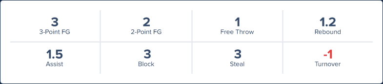
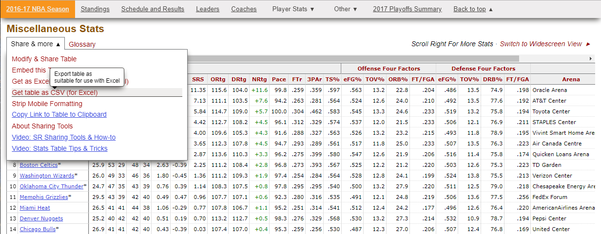

# Fanduel lineup creator

## Background

Fanduel is an online sports fantasy betting website, where users can place wagers on their favourite sports such as NBA basketball. The focus of this project is to produce winning contest entries for fanduel NBA contests. The steps to producing a winning lineup include:

* Collecting and storing relevant NBA data for each NBA player
* Feature engineering more variables which helps to create better player models
* Create models for each individual NBA player which can predict a player's fantasy output
* Using individual player models, and past NBA player data, predict player fantasy output for each player in fanduel contest
* Optimize lineup based on predicted player fantasy outputs to maximize value of contest lineup

These were the objectives of the project, and I have created a web app to test the results - https://fanduel-lineup-creator.herokuapp.com/

The rest of this readme will explain the project in detail.

## NBA Fanduel

Fanduel's betting platform has been gaining popularity significantly, and a main cause of this can be attributed to Fanduel's revolutionary approach to fantasy. In the past the traditional fantasy sports format included players joining a fantasy league where players would draft their team at the beginning of the fantasy year. Players have the ability to add, drop, and trade players throughout the season. 

Fanduel changes this format by introducing daily fantasy contests. Each daily contest on NBA fanduel has a game slate which represents how many games a player is betting on. Each NBA player playing during the game slate is assigned a salary. This salary is representative of how many projected fantasy points that player is expected to produce that night. To finish a lineup the player must choose 2 points guards, 2 shooting guards, 2 small forwards, 2 power forwards and one center, and the total combined salary of the players must be below 60,000. The focus is for the player's lineup to produce the most fantasy points with the given salaries for each NBA player.

The scoring format for Fanduel follows a NBA player's stats for a game:

Daily NBA fantasy allows players to bet on a single night of NBA games, compared to being committed to a whole season of NBA games with the traditional fantasy format. 

## Problem Statement

The steps to producing a winning contest lineup are the same as outlined in the background section:

* Collecting and storing relevant NBA data for each NBA player
* Feature engineering more variables which helps to create better player models
* Create models for each individual NBA player which can predict a player's fantasy output
* Using individual player models, and past NBA player data, predict player fantasy output for each player in fanduel contest
* Optimize lineup based on predicted player fantasy outputs to maximize value of contest lineup

## Data Collection and Storing

All NBA player data was collected and stored using this [jupyter notebook](https://github.com/Eric-Pacheco95/PersonalProjects/blob/master/Fanduel-Lineup-Creator/notebooks/player_stats.ipynb)

To collect NBA player data the [basketball reference web scraper library](https://jaebradley.github.io/basketball_reference_web_scraper/) was used. This library contains all NBA data collected from https://www.basketball-reference.com/

After all the data was collected and formatted, each players data was uploaded to an AWS Redshift database as a table.

NBA team advanced data was also collected from basketball reference, however the data was available to be downloaded as a csv. Each year from 2016-2020 was collected. These advanced stats contain critical NBA team information such as offensive rating, defensive rating, net rating and other stats. These advanced stats weigh heavily on a player's projected fantasy output and are thus critical to creating our player models.

## Feature Engineering

The next step was to produce more relevant variables which can be used to create our player models. At this point in our data collection, each player table contains the game dates, fantasy points scored, locations (Home or Away), Opponent IDs, and the game stats (points, assists rebounds, etc). We could use only these parameters to train our models, however the results and corresponding predictions would most likely not be that accurate. 

Therefore in this [jupyter notebook](https://github.com/Eric-Pacheco95/PersonalProjects/blob/master/Fanduel-Lineup-Creator/notebooks/player_stats_feature_engineering.ipynb), the focus was to find and create relevant variables which can contribute to making a more accurate prediction model for each NBA player.

To start I used the advanced analytics that was downloaded in the previous step. Each team has it's strengths and weaknesses, and based on these attributes, a player may perform better or worse. To showcase these strengths and weaknesses as variables in our model, we can take for example a player's games and attribute the corresponding advanced analytics based on the opponent a player is competing against. This means every game data in our players data will also include columns for opponent advanced stats such as the opponent's offensive ratings, defensive ratings, net ratings, pace, and other relevant stats.

Another key metric in predicting a players fantasy output is the amount of rest a player has had before playing that game. A player normally plays better when he has at least 2 days of rest, and plays worse on average when there is no days of rest. By using the game dates I added 7 new columns which had a binary value of 0 or 1. These 7 columns were no rest, 1 day rest, 2 day rest, 3 day rest, 4 day rest, 5 day rest, and 5+ days rest.

When training a player model, each game a player has played, and the corresponding data (points, rebounds, assists, rest, advanced analytics) is what makes up a data point. As a result, when predicting a player's fantasy output, this format of how each data point is entered must be identical. This is where some issues arised, and I realized I could not train the player models by including each game's basic stats (points, rebounds, assists). This is because of the previous point where the model requires a data point to follow the same format as the data points the model was trained on. The model would expect that the input would include the basic stats, which is impossible because the game has not been played yet. 

To fix this issue, instead of the basic stats being used to train the model, the season averages for each basic stat was added as a column. This average would be inclusive of every game played before each game data, and would therefore show a player's season averages leading into the game. 

Another aspect of NBA games is that player's tend to go on streaks, meaning players sometimes play better for days or weeks at a time or vice-versa. To incorporate this into my variables, I took a similar approach as when implementing the season averages. The same method was taken except the average of each basic stat for the past 7 games was added instead of all-time stats.

Adding the all-time averages, and past 7 days averages was incorporated in this [jupyter notebook](https://github.com/Eric-Pacheco95/PersonalProjects/blob/master/Fanduel-Lineup-Creator/notebooks/xgb_model_creation.ipynb)

## Model Creation

When trying out many different models (SVM, Decision Trees, etc), the best results came from the [XGBoost Regression model](https://xgboost.readthedocs.io/en/latest/python/python_api.html#module-xgboost.sklearn). The process for setting up the models can be seen in this [jupyter notebook](https://github.com/Eric-Pacheco95/PersonalProjects/blob/master/Fanduel-Lineup-Creator/notebooks/xgb_model_creation.ipynb).

When trying to determine the best parameters for each individual model, the sci-kit learn [RandomizedSearchCV](https://scikit-learn.org/0.16/modules/generated/sklearn.grid_search.RandomizedSearchCV.html) function was used to test multiple hyper parameters and return the optimized model parameters. Once the optimized parameters were obtained for each player model, the xgb model was trained again and the models were saved.

## Lineup Optimization

