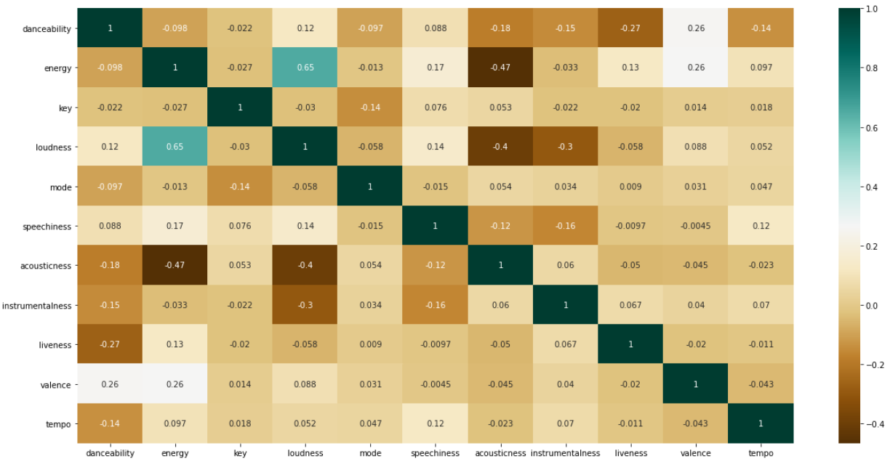
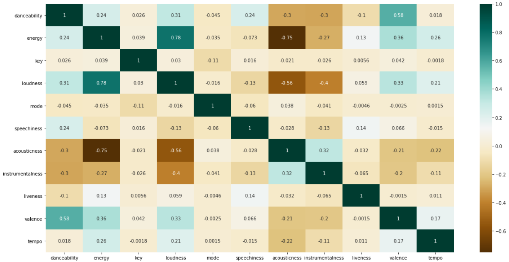

# Spotify Recommendation Model

## Background

I am an avid music listener and I have been using spotify for many years as my listening platform. Because of my passion for music and data science background, of course I had to do a project on creating a song recommendation model! My spotify liked songs contains over 1000+ songs from a variety of genres, and spotify has a neat [api](https://developer.spotify.com/) which allows users to collect their own data, as well as the associated track data. I also included a large spotify dataset taken from [kaggle](https://www.kaggle.com/yamaerenay/spotify-dataset-19212020-160k-tracks) of over 160K random songs and their track features. Combining the large dataset with my liked songs will provide a cumulative dataset that can train a model to predict wether or not a song will be a favourite song.

### Data Retrieval

This [jupyter notebook](https://github.com/Eric-Pacheco95/PersonalProjects/blob/master/Spotify-Recommendation-Model/Notebooks/Get_Spotify_Data.ipynb) was used for data retrieval.

Spotify's API was fairly straight forward to access and use. The first step in the process was collecting the track ids of all liked songs for my account. Using these track ids another spotify api endpoint was used to collect the track features which breakdown a song into 11 features - danceability, energy,key , loudness, mode, speechiness, acousticness, instrumentalness, liveness, valence, and tempo.

The rest of spotify song data which were used as characterizing a non-favourite was taken from [kaggle](https://www.kaggle.com/yamaerenay/spotify-dataset-19212020-160k-tracks).

### Data Formatting

There were a couple steps involved in data formatting, one [notebook](https://github.com/Eric-Pacheco95/PersonalProjects/blob/master/Spotify-Recommendation-Model/Notebooks/Format_Random_Songs_CSV.ipynb) was used to format the kaggle dataset of over 160K+ songs. The rest of the data was formatted in the [model creation notebook](https://github.com/Eric-Pacheco95/PersonalProjects/blob/master/Spotify-Recommendation-Model/Notebooks/Model_Creation.ipynb).

The kaggle dataset included the track id and 11 spotify song features for each track. However, a column feature that I wanted to train the model on was the genre of the song. This was not available as part of the track information, however the genre of the artist is accessible. Using the spotify api and the track ids, the genre of the artist was added as a column for each of the 160K+ songs and saved as a new csv to be accessed in the model creation notebook. This method was also used for my liked songs to retrieve the genres.

In the model creation notebook the formatted kaggle data, and my liked songs data was loaded into separate dataframes. The correlation matrix of each dataset can be seen below.

Liked Songs:

Kaggle Dataset:

